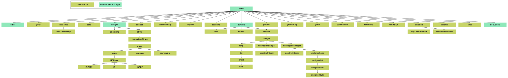

# Comunica Expression Evaluator

[](https://www.npmjs.com/package/@comunica/expression-evaluator)

Previously called sparqlee - sparql expression evaluator. A simple spec-compliant SPARQL 1.1 expression evaluator package.

This module is part of the [Comunica framework](https://github.com/comunica/comunica),
and should only be used by [developers that want to build their own query engine](https://comunica.dev/docs/modify/).

[Click here if you just want to query with Comunica](https://comunica.dev/docs/query/).

## Install

```bash
$ yarn add @comunica/expression-evaluator
```

## Exposed classes

* [`AsyncEvaluator`](https://comunica.github.io/comunica/classes/_comunica_expression_evaluator.AsyncEvaluator.html): An evaluator for SPARQL expressions working with Promises.
* [`IAsyncEvaluatorContext`](https://comunica.github.io/comunica/classes/_comunica_expression_evaluator.IAsyncEvaluatorContext.html): Context used to configure the `AsyncEvaluator`. See [Config](#Config). 
* [`SyncEvaluator`](https://comunica.github.io/comunica/classes/_comunica_expression_evaluator.SyncEvaluator.html): An evaluator for SPARQL expressions working without Promises.
* [`ISyncEvaluatorContext`](https://comunica.github.io/comunica/classes/_comunica_expression_evaluator.ISyncEvaluatorContext.html): Context used to configure the `SyncEvaluator`. See [Config](#Config).
* [`AggregateEvaluator`](https://comunica.github.io/comunica/classes/_comunica_expression_evaluator.AggregateEvaluator.html): An evaluator for SPARQL aggregate expressions working without promises. See [Aggregates](#Aggregates).
* [`ExpressionError`](https://comunica.github.io/comunica/classes/_comunica_expression_evaluator.ExpressionError.html): An error class for SPARQL expression errors as defined in the [error section](#Errors).
* [`isExpressionError`](https://comunica.github.io/comunica/classes/_comunica_expression_evaluator.isExpressionError.html): A way to check if an error is of type `ExpressionError`.
* [`orderTypes`](https://comunica.github.io/comunica/classes/_comunica_expression_evaluator.orderTypes.html): A function to order types according to the [SPARQL ORDER BY specification](https://www.w3.org/TR/sparql11-query/#modOrderBy).
* [`AsyncAggregateEvaluator`](https://comunica.github.io/comunica/classes/_comunica_expression_evaluator.AsyncAggregateEvaluator.html): An evaluator for SPARQL aggregate expressions working with promises. See [Aggregates](#Aggregates).


## Using The Expression Evaluator

```ts
import { translate } from "sparqlalgebrajs";
import { stringToTerm } from "rdf-string";

// An example SPARQL query with an expression in a FILTER statement.
// We translate it to SPARQL Algebra format ...
const query = translate(`
  SELECT * WHERE {
     ?s ?p ?o
     FILTER langMatches(lang(?o), "FR")
    }
`);

// ... and get the part corresponding to "langMatches(...)".
const expression = query.input.expression;

// We create an evaluator for this expression.
// A sync version exists as well.
const evaluator = new AsyncEvaluator(expression);

// We can now evaluate some bindings as a term, ...
const result: RDF.Term = await evaluator.evaluate(
  Bindings({
    ...
    '?o': stringToTerm("Ceci n'est pas une pipe"@fr),
    ...
  })
);

// ... or as an Effective Boolean Value (e.g. for use in FILTER)
const result: boolean = await evaluator.evaluateAsEBV(bindings);
```

Note: If you want to use *aggregates*, or *exists* you should check out the [stream section](#streams).

### Config

The expression evaluator accepts an optional config argument, that is not required for simple use cases,
but for feature completeness and spec compliance it should receive `now, baseIRI, exists, aggregate and bnode`.

For the extended date functionality (see later), an additional context item has been added: `implicitTimezone`.
The choice was made to default to the timezone `now` has.
It can be desired to set it explicitly so `implicitTimezone` does not change over time (i.e., it is not dependent on daylight saving time).

```ts
interface AsyncEvaluatorContext {
  now?: Date;
  baseIRI?: string;

  exists?: (expression: Alg.ExistenceExpression, mapping: Bindings) => Promise<boolean>;
  aggregate?: (expression: Alg.AggregateExpression) => Promise<RDF.Term>;
  bnode?: (input?: string) => Promise<RDF.BlankNode>;
  extensionFunctionCreator?: (functionNamedNode: RDF.NamedNode) => (args: RDF.Term[]) => Promise<RDF.Term> | undefined;
  overloadCache?: LRUCache<string, SomeInternalType>;
  typeCache?: LRUCache<string, SomeInternalType>;
  getSuperType?: (unknownType: string) => string;
  implicitTimezone?: { zoneHours: number; zoneMinutes: number;}; 
}
```

See the [stream](#streams) and [context dependant function](#context_dependant_functions) sections for more info.

### Errors

This package exports an Error class called `ExpressionError` from which all SPARQL related errors inherit.
These might include unbound variables, wrong types, invalid lexical forms, and much more.
More info on errors [here](lib/util/Errors.ts).
These errors can be caught, and may impact program execution in an expected way. 
All other errors are unexpected, and are thus programmer mistakes or mistakes in this package.

There is also the utility function `isExpressionError` for detecting these cases.

```ts
// Make sure to catch errors if you don't control binding input
try {
  const result = await evaluator.evaluate(bindings);
  consumeResult(result;)
} catch (error) {
  if (isExpressionError(error)) {
    console.log(error); // SPARQL related errors
    ...                 // Move on, ignore result, ...
  } else {
    throw error;        // Programming errors or missing features.
  }
}
```

### Exists

'Exists' operations are an annoying problem to tackle in the context of an expression evaluator,
since they make the operation stateful and context dependant.
They might span entire streams and, depending on the use case, have very different requirements for speed and memory consumption.
This package has therefore decided to delegate this responsibility back to you.

You can, if you want, pass hooks to the evaluators of the shape:

```ts
exists?: (expression: Alg.ExistenceExpression, mapping: Bindings) => Promise<boolean>;
```

If this package encounters any or existence expression, it will call this hook with the relevant information, so you can resolve it yourself.
If these hooks are not present, but an existence expression is encountered, then an error is thrown.

An example consumer/hook can be found in [Comunica](https://github.com/comunica/comunica/blob/master/packages/actor-query-operation-filter-sparqlee/lib/ActorQueryOperationFilterSparqlee.ts).;

### Aggregates

We provide an `AggregateEvaluator` to which you can pass the individual bindings in the stream, and ask the aggregated result back.
It uses the internal type system for operations such as `sum` and `avg`.

```ts
const stream = [bindings1, bindings2, bindings3];

if (stream.length === 0) {
  return AggregateEvaluator.emptyValue(aggregateExpression);
} else {
  const evaluator = new AggregateEvaluator(aggregateExpression, bindings[0]);
  stream.slice(1).forEach((bindings) => evaluator.put(bindings));
  return evaluator.result();
}
```

We have not found any SPARQL Algebra for which this occurs,
but we happen to find any aggregate expressions nested in the expression (or even at the top level),
we will call (similarly to EXISTS) an aggregate hook you might have provided.

```ts
aggregate?: (expression: Alg.AggregateExpression) => Promise<RDF.Term>;
```

You can probably ignore this.

We also provide an `AsyncAggregateEvaluator` to that works the same way `AggregateEvaluator` does.
The signature of only the `put` method changes to be async. It is up to you to handle this correctly.
You are for example expected to await all puts before you ask for `result`.
You should also note the order of calling and awaiting put while using the `GroupConcat` aggregator.

### Extension functions

Extension functions can be added by providing the `extensionFunctionCreator` in the config.
Example
```ts
config.extensionFunctionCreator = (functionName: RDF.NamedNode) => {
   if (functionNamedNode.value === 'https://example.org/functions#equal') {
      return async (args: RDF.Term[]) => {
         return literal(String(args[0].equals(args[1])), 'http://www.w3.org/2001/XMLSchema#boolean');       
      }
   }
}
```

### Overload function caching

An functionArgumentsCache allows us to cache the implementation of a function provided the argument types. 
When not providing a cache in the context, the evaluator will create one.
The cache speeds up execution time significantly especially when evaluating a lot of bindings that mostly have the same types.
This statement is backed up by the [integer addition benchmark](/benchmarks/integerAddition.ts).

This cache can be reused across multiple evaluators. We don't recommend manual modification.

### Super type discovery

The `superTypeProvider:discoverer` allow a user to use custom types and define their super relationship to other types.
Example:
```ts
const superTypeDiscoverCallback = (unknownType: string) => {
  if (unknownType === "http://example.org/label") {
    return 'http://www.w3.org/2001/XMLSchema#string';
  }
  return 'term';
}
```
This is helpful when performing queries over data that uses data-types that are a restriction on the known xsd data types.
For example a datasource could define `ex:label = "good" | "bad"`. These are both strings,
and we could for example call the `substr` function on these values.
When we want to allow this in a type safe way, we need to check if `ex:label` is a restriction on string.

The `superTypeProvider:cache` allows us to cache these super type relationships.
This cache can be reused across multiple evaluators. We don't recommend manual modification.


### Context dependant functions

Some functions (BNODE, NOW, IRI) need a (stateful) context from the caller to function correctly according to the spec.
This context can be passed as an argument to the evalator (see the [config section](#config) for exact types).
If they are not passed, the evaluator will use a naive implementation that might do the trick for simple use cases.

#### BNODE

[spec](https://www.w3.org/TR/sparql11-query/#func-bnode)

Blank nodes are very dependent on the rest of the SPARQL query, therefore, 
we provide the option of delegating the entire responsibility back to you by accepting a blank node constructor callback.
If this is not found, we create a blank node with the given label,
or we use uuid (v4) for argument-less calls to generate definitely unique blank nodes of the shape `blank_uuid`.

`bnode(input?: string) => RDF.BlankNode`

#### Now

[spec](https://www.w3.org/TR/sparql11-query/#func-now)

All calls to now in a query must return the same value, since we aren't aware of the rest of the query,
you can provide a timestamp (`now: Date`). If it's not present, the evaluator will use the timestamp of evaluator creation,
this at least allows evaluation with multiple bindings to have the same `now` value.

#### IRI

[spec](https://www.w3.org/TR/sparql11-query/#func-iri)

To be fully spec compliant, the IRI/URI functions should take into account base IRI of the query,
which you can provide as `baseIRI: string` to the config.

### SPARQL 1.2

This package looks forward and already implements some SPARQL 1.2 specification functions.

Currently, this is restricted to the [extended date](https://github.com/w3c/sparql-12/blob/main/SEP/SEP-0002/sep-0002.md) functionality.
Please note that the new built-in `ADJUST` function has not been implemented due to package dependencies.

## Development

## Setup locally

1. Install `yarn` and `node`.
2. Run `yarn install`.
3. Use these evident commands (or check `package.json`):
    - building once: `yarn run build`
    - benchmarking: `yarn run bench`

### Adding or fixing functions

Functions are defined in the [functions directory](lib/functions/), and you can add or fix them there.
All definitions are defined using a builder model defined in [Helpers.ts](lib/functions/Helpers.ts).

Three kinds exists:

- Regular functions: Functions with a uniform interface, that only need their arguments to calculate their result.
- Special functions: whose behaviour deviates enough from the norm to warrant the implementations taking full control
over type checking and evaluation (these are mostly the functional forms). 
They are seperated from the regular functions because they are able to take control over the evaluation.
Since we have support both async and sync evaluations, each having a distinct context, special functions require an implementation for both.
For regular functions, the sync and async evaluation is the same, to avoid overhead, we differentiate between these two.
- Named functions: which correspond to the SPARQLAlgebra Named Expressions.

### Layout and control flow

The only important external facing API is creating an Evaluator.
When you create one, the SPARQL Algebra expression that is passed will be transformed to an internal representation (see [Transformation.ts](./lib/Transformation.ts)).
This will build objects (see [expressions module](./lib/expressions)) that contain all the logic and data for evaluation,
for example the implementations for SPARQL functions (see [functions module](./lib/functions)).
After transformation, the evaluator will recursively evaluate all the expressions.

### Type System

See [functions/Core.ts](./lib/functions/Core.ts), [funcions/OverloadTree.ts](.lib/funcions/OverloadTree.ts) and
[util/TypeHandling.ts](./lib/util/TypeHandling.ts).

The type system is tailored for doing (supposedly) quick evaluation of overloaded functions.

A function definition object consists of a tree-like structure with a type (e.g. `xsd:float`) at each internal node.
Each level of the tree represents an argument of the function
(e.g. function with arity two also has a tree of depth two).
The leaves contain a function implementation matching the concrete types defined by the path of the tree.

When a function is called with some arguments, a depth first search,
to find an implementation among all overloads matching the types of the arguments,
is performed in the tree.
If we can not find one, we consider the argument of invalid types.

We also handle **[subtype substitution](https://www.w3.org/TR/xpath-31/#dt-subtype-substitution)** for literal terms.
What this means is that for every argument of the function, and it's associated accepted type,
we also accept all subtypes of that type for that argument.
These sub/super-type relations define the following type tree:

So, when expecting an argument of type `xsd:integer` we could provide `xsd:long` instead and the
function call would still succeed. The type of the term does not change in this operation.

We also handle **[type promotion](https://www.w3.org/TR/xpath-31/#promotion)**,
it defines some rules where a types can be promoted to another, even if there is no super-type relation.
Examples include `xsd:float`  and `xsd:decimal` to `xsd:double`and `xsd:anyURI` to `xsd:string`.
In this case, the datatype of the term will change to the type it is promoted to.

### Testing

The testing environment is set up to do a lot of tests with little code.
The files responsible for fluent behaviour reside in `test/util`.  
Most tests can be run by running the `runTestTable` method in `test/util/utils.ts`.
This method expects a TestTable. Multiple test are run over a TestTable (one for every line).
A TestTable may contain aliases if the aliases are also provided
(Some handy aliases reside in `test/util/Aliases.ts`).
This means that when testing something like `"3"^^xsd:integer equals "3"^^xsd:integer` is `"true"^^xsd:boolean`.
We would write a small table (for this example some more tests are added) and test it like this:
```ts
import { bool, merge, numeric } from './util/Aliases';
import { Notation } from './util/TruthTable';
import { runTestTable } from './util/utils';
runTestTable({
   testTable: `
       3i 3i = true
       3i -5i = false
       -0f 0f = true
       NaN  NaN = false
   `,
   arity: 2,
   operation: '=',
   aliases: merge(numeric, bool),
   notation: Notation.Infix,
});
```
More options can be provided and are explained with the type definition of the argument of `runTestTable`.

We can also provide an `errorTable` to the `runTestTable` method.
This is used when we want to test if calling certain functions on certain arguments throws the error we want.
An example is testing whether `Unknown named operator` error is thrown when
we don't provide the implementation for an extension function.
```ts
import { bool, merge, numeric } from './util/Aliases';
import { Notation } from './util/TruthTable';
import { runTestTable } from './util/utils';
runTestTable({
   errorTable: `
       3i 3i = 'Unknown named operator'
       3i -5i = 'Unknown named operator'
       -0f 0f = 'Unknown named operator'
       NaN  NaN = 'Unknown named operator'
   `,
   arity: 2,
   operation: '<https://example.org/functions#equal>',
   aliases: merge(numeric, bool),
   notation: Notation.Infix,
});
```
When you don't care what the error is, you can just test for `''`.

In case the tables are too restrictive for your test, and you need an evaluation.
You should still use the `generalEvaluate` function from `test/util/generalEvaluation.ts`.
This function will automatically run both async and sync when possible.
This increases your tests' coverage.
